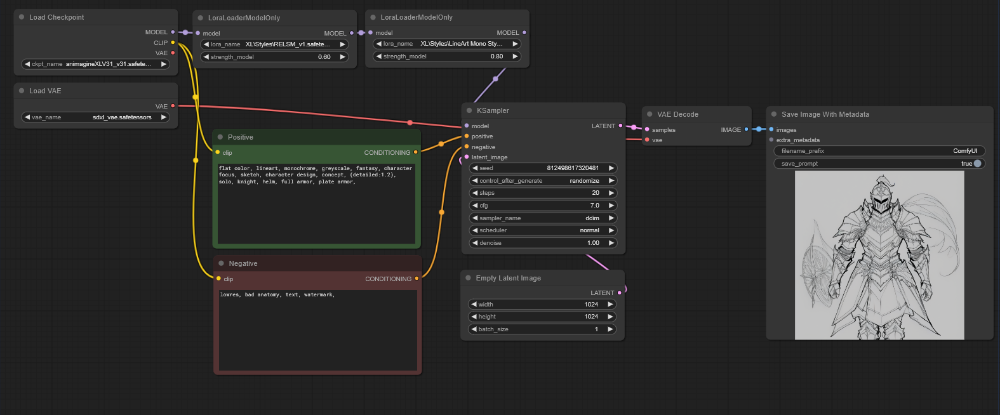
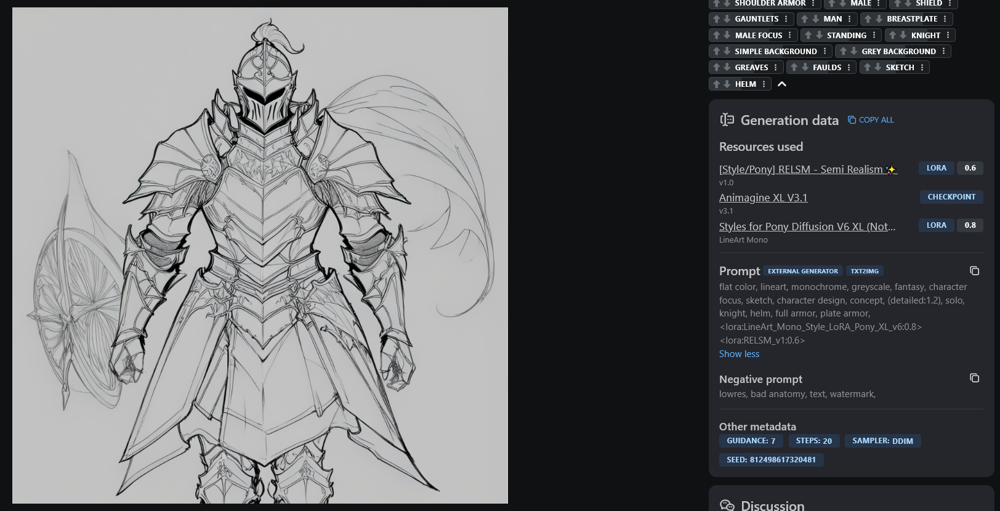

# ComfyUI-ImageMetadataExtension

Custom node for [ComfyUI](https://github.com/comfyanonymous/ComfyUI). It adds additional metadata for saved images, ensuring compatibility with the Civitai website.

This is a fork of [nkchocoai/ComfyUI-SaveImageWithMetaData](https://github.com/nkchocoai/ComfyUI-SaveImageWithMetaData).

**Key differences:**
- Simplified the node by removing unnecessary fields for general use.
- Included metadata for LoRa weights.
- The `subdirectory_name` field allows you to specify a custom name or use mask values to create a subdirectory for saved images. For example, using the mask `%date:yyyy-MM%` ([formatting options](#formatting-options)) will create a directory named with the current year and month (e.g., `2024-10`), organizing your images by the date they were generated.
- The `output_format` specifies how images are saved. Supported formats are:
  - `png`, `jpg`, `webp` – saves the image in the specified format.
  - `png_with_json`, `jpg_with_json`, `webp_with_json` – saves the image in the chosen format and writes metadata to a JSON file with the same name.
- The `metadata_scope` option includes the following levels:
  - **`full`** – includes default metadata plus extra metadata.
  - **`default`** – same as the SaveImage node.
  - **`workflow_only`** – workflow metadata only.
  - **`none`** – no metadata.

## Installation

### Recommended Installation

Use the [ComfyUI-Manager](https://github.com/ltdrdata/ComfyUI-Manager) to install.

```
ComfyUI-ImageMetadataExtension
```

### Manual Installation

1. Navigate to the `custom_nodes` directory inside your ComfyUI folder.
2. Clone this repository:

  ```bash
   cd <ComfyUI directory>/custom_nodes
   git clone https://github.com/edelvarden/ComfyUI-ImageMetadataExtension.git
  ```

## Usage

Basic usage looks like ([workflow.json](assets/workflow.json)):



Lora strings are automatically added to the prompt area, allowing the Civitai website to understand the weights you used. Other metadata is also successfully included.



## Formatting Options
- The `filename_prefix` and `subdirectory_name` support the following options:

| Key             | Information to be Replaced            |
| --------------- | ------------------------------------- |
| %seed%          | Seed value                            |
| %width%         | Image width                           |
| %height%        | Image height                          |
| %pprompt%       | Positive prompt                       |
| %pprompt:[n]%   | First n characters of positive prompt |
| %nprompt%       | Negative prompt                       |
| %nprompt:[n]%   | First n characters of negative prompt |
| %model%         | Checkpoint name                       |
| %model:[n]%     | First n characters of checkpoint name |
| %date%          | Date of generation (yyyyMMddhhmmss)  |
| %date:[format]% | Date of generation                    |

- See the following table for the identifiers specified by `[format]` in `%date:[format]%`:

| Identifier | Description                 |
| ---------- | --------------------------- |
| yyyy       | Year                        |
| yy         | Short year format           |
| MM         | Month                       |
| dd         | Day                         |
| hh         | Hour                        |
| mm         | Minute                      |
| ss         | Second                      |
